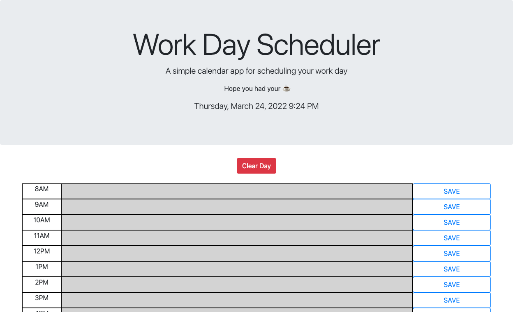

# repo_daily_planner
I have created a daily planner for your use! This planner is linked to the current date and time so that your schedule can move just like you do. This planner will allow you to add anything that your day can throw at you hour by hour, as well as remove the day when you're finished. I have color coded it as well so you can see when the hour passes and you know exactly whats next up in your day. Please enjoy :)

Tools I used for this application:  
HTML  
CSS  
JavaScript  
JQuery 
Bootcamp 
Moment() 
